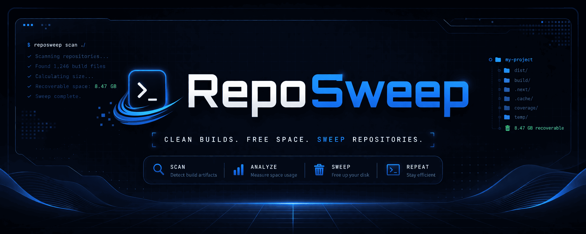

<div align="center">
  
  <p><strong>Rust-native cleanup for developer repositories.</strong></p>
  <p>
    <a href="https://github.com/youssefsz/reposweep/releases"></a>
    <a href="https://github.com/youssefsz/reposweep/actions/workflows/release.yml"></a>
    <a href="./LICENSE"></a>
    
    
  </p>
</div>

`RepoSweep` scans a chosen path for dependency folders, build outputs, and disposable caches, then lets you review and remove them through a scriptable CLI or an interactive terminal UI.

Created by [Youssef Dhibi](https://dhibi.tn).

This repository is inspired by the original Python project [TheLime1/shatter](https://github.com/TheLime1/shatter), but it is not a direct port. It is a separate Rust implementation with its own core engine, CLI workflow, and TUI.

## Inspiration

Credit to the original project that inspired this repo:

- [TheLime1/shatter](https://github.com/TheLime1/shatter) - Python cleanup utility for build artifacts and dependency bloat

If you want the original Python experience, use that repository. If you want a Rust-based implementation with a modular core crate and terminal UI, this repo is that separate take on the idea.

## Features

- Rust workspace split into `reposweep-core`, `reposweep-cli`, and `reposweep-tui`
- Interactive terminal UI for browsing scan results before deleting
- Non-interactive CLI commands for scanning and cleaning
- Scope filters for `cache`, `dependencies`, or `all`
- Accurate size calculation or faster scan mode with `--fast`
- Safe cleanup to trash by default, with optional permanent deletion
- `.reposweepignore` support to skip protected subtrees entirely
- Config bootstrap with `reposweep config init`

## Install

Install the latest release on Linux or macOS:

```bash
curl -sSL https://raw.githubusercontent.com/youssefsz/reposweep/main/install.sh | bash
```

Install the latest release on Windows PowerShell:

```powershell
powershell -ExecutionPolicy Bypass -c "irm https://raw.githubusercontent.com/youssefsz/reposweep/main/install.ps1 | iex"
```

Install a specific version:

```bash
curl -sSL https://raw.githubusercontent.com/youssefsz/reposweep/main/install.sh | bash -s -- --version v0.1.1
```

```powershell
powershell -ExecutionPolicy Bypass -c "$env:REPOSWEEP_VERSION='v0.1.1'; irm https://raw.githubusercontent.com/youssefsz/reposweep/main/install.ps1 | iex"
```

Build from source:

```bash
cargo install --path crates/reposweep-cli
```

Upgrade an installed binary in place:

```bash
reposweep upgrade
```

## Usage

Launch the terminal UI:

```bash
reposweep
```

Launch the terminal UI with an explicit path:

```bash
reposweep tui ~/projects
```

Scan a path from the CLI:

```bash
reposweep scan ~/projects/my-app
```

Scan only dependency directories older than 30 days:

```bash
reposweep scan ~/projects --scope dependencies --older-than 30d
```

Clean caches non-interactively by moving them to trash:

```bash
reposweep clean ~/projects/my-app --scope cache --strategy trash --yes
```

Clean everything permanently:

```bash
reposweep clean ~/projects/my-app --scope all --strategy permanent --yes
```

Initialize the default config:

```bash
reposweep config init
```

Upgrade to the latest published release:

```bash
reposweep upgrade
```

Upgrade to a specific release:

```bash
reposweep upgrade --version v0.1.1
```

Uninstall the binary from the current machine:

```bash
reposweep uninstall
```

## What It Cleans

Built-in rules currently cover common targets such as:

- JavaScript: `node_modules`, `.pnpm-store`, `.yarn`, `.next`, `.turbo`, `.parcel-cache`, `dist`
- Python: `__pycache__`, `.pytest_cache`, `.mypy_cache`, `.ruff_cache`, `.venv`, `venv`, `.tox`
- Rust: `target`
- Java: `.gradle`
- Dart and Flutter: `.dart_tool`, `.pub-cache`
- .NET: `bin`, `obj`
- Generic project outputs: `build`, `.cache`, `.idea`

## Protection And Config

Drop a `.reposweepignore` file into any directory you never want scanned. When present, that directory and its children are skipped.

The default config can be generated with:

```bash
reposweep config init
```

The generated config lets you disable ecosystems, add protected paths, define custom rules, and set the default delete strategy.

## Architecture

- `crates/reposweep-core`: scanning, rules, config, deletion services
- `crates/reposweep-cli`: command-line entrypoint and scripting workflow
- `crates/reposweep-tui`: interactive terminal interface built on Ratatui

## Author

[Youssef Dhibi](https://dhibi.tn) created RepoSweep.

## License

RepoSweep is available under the [MIT License](./LICENSE).

## Release Assets

The install script expects GitHub Release archives named like:

- `reposweep-v0.1.1-x86_64-unknown-linux-gnu.tar.gz`
- `reposweep-v0.1.1-aarch64-unknown-linux-gnu.tar.gz`
- `reposweep-v0.1.1-x86_64-apple-darwin.tar.gz`
- `reposweep-v0.1.1-aarch64-apple-darwin.tar.gz`
- `reposweep-v0.1.1-x86_64-pc-windows-msvc.zip`

Those archives are produced automatically by the release workflow when you push a `v*` tag.
